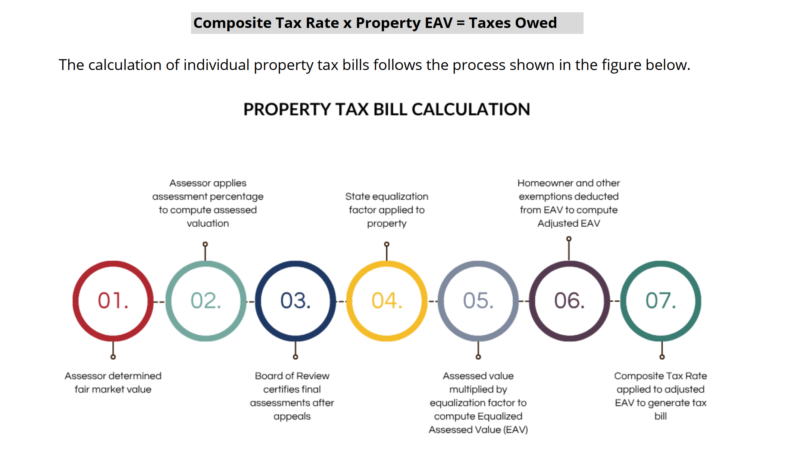

```{r}
#| label: display-helpers


suppressPackageStartupMessages({
  library(tidyverse)
  library(haven)
  library(fixest)
  library(modelsummary)
  library(broom)
  library(glue)
  library(readr)
  library(gt)
})

options(scipen = 999)

table_dir <- fs::path("paper", "tables")

missing_output <- function(path) {
  cat(
    paste0(
      "<p><strong>Missing saved output:</strong> <code>",
      htmltools::htmlEscape(as.character(path)),
      "</code></p>",
      "<p>Render with <code>-P run_models:true</code> to create it.</p>"
    )
  )
}

display_model_table <- function(file_stub, title = NULL, notes = NULL, coef_map = NULL,
                                gof_omit = "IC|Log|Adj|RMSE", gof_function = NULL, add_rows = NULL) {
  model_path <- fs::path(table_dir, paste0(file_stub, "_models.rds"))

  if (!fs::file_exists(model_path)) {
    missing_output(model_path)
    return(invisible(NULL))
  }

  models <- readRDS(model_path)

  modelsummary(
    models,
    title = title,
    notes = notes,
    coef_map = coef_map,
    stars = c("+" = 0.1, "*" = .05, "**" = .01, "***" = .001),
    gof_omit = gof_omit,
    add_rows = add_rows
  )
}

display_df_table <- function(file_stub, title = NULL, digits = 3) {
  rds_path <- fs::path(table_dir, paste0(file_stub, ".rds"))

  if (!fs::file_exists(rds_path)) {
    missing_output(rds_path)
    return(invisible(NULL))
  }

  readRDS(rds_path) |>
    knitr::kable(
      format = "html",
      caption = title,
      digits = digits,
      escape = TRUE
    )
}

# ================================================================
# 4. HELPERS
# ================================================================

vcov_uid <- ~n_uniqueid

tidy_plus <- function(model, extra = NULL) {
  out <- broom::tidy(model)
  if (!is.null(extra)) {
    attr(out, "extra") <- extra
  }
  out
}

safe_wald_p <- function(model, hypothesis) {
  out <- tryCatch(fixest::wald(model, hypothesis), error = function(e) NULL)
  if (is.null(out)) return(NA_real_)
  out$p
}

safe_lincom <- function(model, combo) {
  out <- tryCatch(fixest::lincom(model, combo), error = function(e) NULL)
  if (is.null(out)) {
    return(tibble(estimate = NA_real_, ci_low = NA_real_, ci_high = NA_real_, p.value = NA_real_))
  }
  tibble(
    estimate = out$estimate,
    ci_low   = out$ci_low,
    ci_high  = out$ci_high,
    p.value  = out$p.value
  )
}

# ---- output folder ---------------------------------------------------------
# These HTML outputs are intentionally written to a stable, Quarto-friendly
# path for the replication site.
output_dir <- file.path("paper", "tables")
dir.create(output_dir, recursive = TRUE, showWarnings = FALSE)


save_table <- function(models, file_stub, title = NULL, notes = NULL,
                       coef_map = NULL, gof_omit = "IC|Log|Adj|RMSE",
                       gof_function = NULL,
                       add_rows = NULL) {

  out_html <- file.path(output_dir, paste0(file_stub, ".html"))
  out_rds  <- file.path(output_dir, paste0(file_stub, "_models.rds"))

  modelsummary(
    models,
    output = out_html,
    title = title,
    notes = notes,
    coef_map = coef_map,
    stars = c("*" = .10, "**" = .05, "***" = .01),
    gof_omit = gof_omit
  )

  saveRDS(models, out_rds)
  invisible(models)
}

html_escape <- function(x) {
  x <- as.character(x)
  x <- gsub("&", "&amp;", x, fixed = TRUE)
  x <- gsub("<", "&lt;", x, fixed = TRUE)
  x <- gsub(">", "&gt;", x, fixed = TRUE)
  x
}

save_df_table <- function(df, file_stub, title = NULL, digits = 3) {
  out_html <- file.path(output_dir, paste0(file_stub, ".html"))
  out_rds  <- file.path(output_dir, paste0(file_stub, ".rds"))

  df_out <- df |>
    mutate(across(where(is.numeric), ~ round(.x, digits)))

  html <- knitr::kable(df_out, format = "html", caption = title, escape = TRUE)
  writeLines(html, out_html)
  saveRDS(df_out, out_rds)
  invisible(df_out)
}

safe_se <- function(model, term) {
  out <- tryCatch(fixest::se(model)[[term]], error = function(e) NA_real_)
  if (is.null(out)) NA_real_ else out
}

safe_coef <- function(model, term) {
  out <- tryCatch(stats::coef(model)[[term]], error = function(e) NA_real_)
  if (is.null(out)) NA_real_ else out
}

model_n <- function(model) {
  out <- tryCatch(fixest::nobs(model), error = function(e) NULL)
  if (is.null(out)) out <- tryCatch(stats::nobs(model), error = function(e) NULL)
  if (is.null(out)) out <- tryCatch(model$nobs, error = function(e) NULL)
  if (is.null(out) || length(out) == 0 || is.na(out[1])) return(NA_integer_)
  as.integer(out[1])
}

term_stats <- function(model, term = "d_eav", label = NULL) {
  est <- safe_coef(model, term)
  se  <- safe_se(model, term)
  tibble(
    model = label %||% deparse(substitute(model)),
    N = model_n(model),
    estimate = est,
    std_error = se,
    upper_bound = est + 1.645 * se,
    p_value = tryCatch(2 * pnorm(abs(est / se), lower.tail = FALSE), error = function(e) NA_real_)
  )
}

p_equal_terms <- function(model, lhs = "neg_d_eav", rhs = "pos_d_eav") {
  tryCatch(fixest::wald(model, paste0(lhs, " = ", rhs))$p, error = function(e) NA_real_)
}

lincom_sum <- function(model, terms, label = NULL) {
  b <- stats::coef(model)
  V <- tryCatch(stats::vcov(model), error = function(e) NULL)
  if (is.null(V) || !all(terms %in% names(b)) || !all(terms %in% rownames(V))) {
    return(tibble(
      model = label %||% deparse(substitute(model)),
      N = model_n(model),
      lagged_magnitude = NA_real_,
      std_error = NA_real_,
      A_upper_bound = NA_real_,
      lagged_p = NA_real_
    ))
  }
  est <- sum(b[terms])
  Vsub <- V[terms, terms, drop = FALSE]
  se <- sqrt(sum(Vsub))
  tibble(
    model = label %||% deparse(substitute(model)),
    N = model_n(model),
    lagged_magnitude = est,
    std_error = se,
    A_upper_bound = est + 1.645 * se,
    lagged_p = 2 * pnorm(abs(est / se), lower.tail = FALSE)
  )
}

sample_index <- function(model, data) {
  idx <- tryCatch(fixest::obs(model), error = function(e) NULL)
  if (!is.null(idx)) return(idx)
  # fallback: mark complete cases for variables used in the model is not perfect,
  # but prevents hard failure if fixest::obs changes.
  seq_len(nrow(data))
}

safe_first_stage_f <- function(model) {
  # fixest exposes several IV fit statistics, but names differ across versions.
  out <- tryCatch(fixest::fitstat(model, "ivwald1"), error = function(e) NULL)
  if (is.null(out)) return(NA_real_)
  as.numeric(unlist(out))[1]
}

`%||%` <- function(x, y) if (is.null(x)) y else x


```

# Data preparation and shared helpers

This setup chunk reads the raw files, constructs the variables, defines the model helpers, and creates the `results/tables/` folder. It is visible for transparency but folded by default.

```{r}
#| label: data-prep-and-helpers


# Setup ----------------------------------------------------------------------
# descriptive_stats_15_lags_cluster.R
# Rough R translation of: descriptive stats_15_lags_cluster.do
# Converted from Stata to R on 2026-03-06.
# Updated on May 11th 2026 using 22_lags_cluster.do
#
# Notes:
# - Stata's esttab output is translated to modelsummary output. You can
# - Some table formatting is approximate rather than identical.
```

```{r}
# ================================================================
# 1. READ + MERGE DATA
# ================================================================

message(Sys.Date())
message(format(Sys.time(), "%H:%M:%S"))


# file DM used:  #"NTA_data_2024_10_14.csv"
# email shows that he had questions about this file and then michael sent one for 10_16
main_df <- read_csv("NTA_data_2024_10_14.csv")

# main_df |> distinct(agency_group)
#415 distinct agency_groups in the 10_14 file.

# File MVH sent him:
# main_df <- read_csv("NTA_data_2024_10_16.csv") |>
#   arrange(type)


# Most recent file AWM had on her computer:
# main_df <- read_csv("NTA_data_2024_11_08.csv") |>
# arrange(type)


agency_lookup <- read_dta("Necessary_Files/fips_all_agency_name.dta")

# anti_join(main_df, agency_lookup)

main_df <- main_df |>
  left_join(agency_lookup, by = "agency_group")
# 7470 observations before dropping NAs
# 7416 after dropping NAs
# Stata listed unmatched rows and dropped merge==1 rows.
# In dplyr terms: drop observations from master that did not match.
main_df <- main_df |>
  filter(!is.na(fipsid))

census_df <- read_dta("Necessary_Files/census_data.dta")

# 3,509 observations didn't have the census data and get dropped unless missing data is filled in between census years.
#anti_join(main_df, census_df)

main_df <- main_df |>
  left_join(census_df, by = c("fipsid", "year"))

# ================================================================
# 2. MERGE EQUALIZATION FACTORS + CLEAN NUMERIC FIELDS
# ================================================================

# Stata used a .dta called eq_factor after previously creating it from CSV.
# Adjust extension if your stored file is actually .csv.

eq_factor_path_dta <- file.path("Necessary_Files/eq_factor.dta")
eq_factor_path_csv <- file.path("Necessary_Files/eq_factor.csv")

eq_factor <- if (file.exists(eq_factor_path_dta)) {
  read_dta(eq_factor_path_dta)
} else if (file.exists(eq_factor_path_csv)) {
  read_csv(eq_factor_path_csv, show_col_types = FALSE)
} else {
  stop("Could not find eq_factor.dta or eq_factor.csv in post nta folder.")
}

main_df <- main_df |>
  left_join(eq_factor, by = "year")

string_num_vars <- c("assess_year_eav",  "assess_year_av", "av_true", "rate_smooth", "total_final_levy")

main_df <- main_df |>
  mutate(
    across(
      any_of(string_num_vars),
      ~ readr::parse_number(as.character(.x), na = c("NA", "", ".")),
      .names = "n_{.col}"
    )
  )

# ================================================================
# 3. PANEL SETUP + CONSTRUCTED VARIABLES
# ================================================================

main_df <- main_df |>
  mutate(
    n_agency_group = as.integer(factor(agency_group)),
    n_uniqueid     = as.integer(factor(uniqueid))
  ) |>
  arrange(n_agency_group, year) |>
  filter(!is.na(n_agency_group)) |>
  group_by(n_agency_group) |>
  arrange(year, .by_group = TRUE) |>
  mutate(
    lag_av = lag(av, 1),
    lag2_av = lag(av, 2),
    lag3_av = lag(av, 3),
    lead1_av = lead(av, 1),
    lead2_av = lead(av, 2),
    lead3_av = lead(av, 3),
    lag_eq_factor_final = lag(eq_factor_final, 1),
    lag2_eq_factor_final = lag(eq_factor_final, 2),
    lag3_eq_factor_final = lag(eq_factor_final, 3),
    lag_reassess_year = lag(reassess_year, 1),
    lag2_reassess_year = lag(reassess_year, 2)
  ) |>
  ungroup() |>
  filter(year >= 2008)

main_df <- main_df |>
  mutate(
    t = case_when(
      reassess_year == 1 ~ 1,
      lag_reassess_year == 1 ~ 2,
      lag2_reassess_year == 1 ~ 3,
    ),
    r = case_when(
      t == 1 ~ ((lead3_av / av)^(1 / 3)) - 1,
      t == 2 ~ ((lead2_av / lag_av)^(1 / 3)) - 1,
      t == 3 ~ ((lead1_av / lag2_av)^(1 / 3)) - 1,
      TRUE ~ 0
    ),
    EstV = case_when(
      t == 1 ~ av,
      t == 2 ~ lag_av * (1 + r),
      t == 3 ~ lag2_av * (1 + r)^2,
      TRUE ~ 0
    ),
    ln_EstV = log(EstV),
    d_av = 100 * log(av / lag_av)) |>
  group_by(n_agency_group) |>
  mutate(
    d_eav = 100 * log((av * eq_factor_final) / (lag_av * lag(eq_factor_final))),
    d_levy = 100 * log(total_final_levy / lag(total_final_levy)),
    d_total_ig_revenue = 100 * log(total_ig_revenue / lag(total_ig_revenue)),
    d_enrollment = 100 * log(enrollment / lag(enrollment)),
    has_ig_data = if_else(is.na(d_total_ig_revenue), 0, 1),
    type_2 = case_when(
      type == "Muni" & home_rule_ind == 1 ~ "HR_muni",

      ## Added this row below!!
      type == "Muni" & home_rule_ind == 0 ~ "NonHR_muni",
      TRUE ~ as.character(type)
    )
  ) |> ungroup()


reg_df <- main_df |>
  filter(year > 2008)


reg_df <- reg_df |>
  mutate(
    # Keep municipal types separate in by-type models.
    type_2 = case_when(
      type == "Muni" & home_rule_ind == 1 ~ "HR_muni",
      type == "Muni" & home_rule_ind == 0 ~ "NonHR_muni",
      TRUE ~ as.character(type)
    ),
    # Use a non-missing home-rule flag for year-by-home-rule fixed effects.
    home_rule_for_fe = replace_na(as.integer(home_rule_ind), 0L)
  )


gov_types <- c("Other", "Township", "HR_muni", "NonHR_muni", "School")
gov_types_B <- c("HR_muni", "NonHR_muni", "School")
minor_types <- c("ELEMENTARY", "SECONDARY")

gof_omit = "IC|Log|Adj|RMSE"
```


# Main paper tables

## Table 1. Distribution of Percentage Changes in Levies and EAV

```{r tbl1}
# summarize d_levy and d_eav by type
## Table 1. Distribution of Percentage Changes in Levies and EAV

table1 <- reg_df |>
  filter(year >= 2009) |>
  mutate(
    agency_type = case_when(
      type == "Muni" ~ "All Munis",
      type == "School" ~ "Schools",
      type == "Township" ~ "Townships",
      type == "Other" ~ "Other Districts"
    )
  ) |>
  select(agency_type, d_levy, d_eav) |>
  pivot_longer(
    cols = c(d_levy, d_eav),
    names_to = "stat",
    values_to = "value"
  ) |>
  group_by(agency_type, stat) |>
  summarize(
    N = sum(!is.na(value)),
    p5 = quantile(value, .05, na.rm = TRUE),
    p25 = quantile(value, .25, na.rm = TRUE),
    p50 = quantile(value, .50, na.rm = TRUE),
    p75 = quantile(value, .75, na.rm = TRUE),
    p95 = quantile(value, .95, na.rm = TRUE),
    .groups = "drop"
  )

table1_all <- reg_df |>
  filter(year >= 2009) |>
  mutate(
    agency_type = case_when(
      type == "Muni" ~ "All Munis",
      type == "School" ~ "Schools",
      type == "Township" ~ "Townships",
      type == "Other" ~ "Other Districts"
    )
  ) |>
  select(agency_type, d_levy, d_eav) |>
  pivot_longer(
    cols = c(d_levy, d_eav),
    names_to = "stat",
    values_to = "value"
  ) |>
  group_by(stat) |>
  summarize(
    N = sum(!is.na(value)),
    p5 = quantile(value, .05, na.rm = TRUE),
    p25 = quantile(value, .25, na.rm = TRUE),
    p50 = quantile(value, .50, na.rm = TRUE),
    p75 = quantile(value, .75, na.rm = TRUE),
    p95 = quantile(value, .95, na.rm = TRUE),
    .groups = "drop"
  ) |> mutate(agency_type = "All", .after = )

table1 |>
  rbind(table1_all) |>
  gt() |>
  fmt_number(
    columns = c(p5, p25, p50, p75, p95),
    decimals = 1
  ) |>
  tab_header(
    title = md("**Table 1. Distribution of Percentage Changes in Levies and EAV**")
  )
```

## Table 2. All-agency OLS


"At the bottom of table 2, we also include our estimated “upper bound” for ε_b—this tells us the maximum value of the elasticity that we fail to reject with 95 percent confidence—i.e. we can reject the hypothesis that ε_b is greater than the upper bound with 95 percent confidence. As shown in the table, even these upper bounds are quite small and always much less than 1."


```{r}
#| label: table-02-create


all_ols_1 <- feols(d_levy ~ d_eav,
  data = reg_df, cluster = vcov_uid)

all_ols_2 <- feols(d_levy ~ d_eav | year^home_rule_for_fe,
  data = reg_df, cluster = vcov_uid)

all_ols_3 <- feols(d_levy ~ d_eav | year^home_rule_for_fe + n_uniqueid,
  data = reg_df, cluster = vcov_uid)

all_ols_models_v22 <- list(M1 = all_ols_1, M2 = all_ols_2, M3 = all_ols_3)

save_table(
  all_ols_models_v22,
  file_stub = "v22_table_02_OLS_all_agencies",
  title = "Table 2: All agencies OLS Predict levy using d_eav",
  notes = c(
    "Cook County, Illinois data from 2008 through 2023.",
    "Columns 2 and 3 include year-by-home-rule fixed effects; column 3 includes unit fixed effects."
  ),
  coef_map = c("d_eav" = "Change in EAV")
)

save_df_table(
  bind_rows(
    term_stats(all_ols_1, "d_eav", "M1"),
    term_stats(all_ols_2, "d_eav", "M2"),
    term_stats(all_ols_3, "d_eav", "M3")
  ),
  "v22_table_02_OLS_all_agencies_upper_bounds",
  "Table 2: Upper bounds for all-agency OLS"
)

# ================================================================
```

```{r}
#| label: table-02-display

display_model_table(
  "v22_table_02_OLS_all_agencies",
  title = "Table 2. All-agency OLS estimates",
  notes = c(
    "Cook County, Illinois data from 2008 through 2023.",
    "Columns 2 and 3 include year-by-home-rule fixed effects; column 3 includes unit fixed effects."
  ),
  coef_map = c("d_eav" = "Change in EAV")
)

display_df_table(
  "v22_table_02_OLS_all_agencies_upper_bounds",
  title = "Upper-bound summary for Table 2"
)
```

## Table 3. All-agency IV

"In table 3 we treat the change in the tax base (d_eav) as endogenous and instrument for it using the timing of reassessments. For the timing of reassessments to be a valid instrument for the change in the tax base requires that (i) reassessments are a strong predictor of changes in EAV and (ii) reassessments do not influence the change in the levy except to the extent that they affect the change in the tax base."

DFM Notes for Stata: 
"Montiel Olea, J. L. and C. E. Pueger (2013) A robust test for weak instruments, Journal of Business and Economic Statistics, Vol. 31, pp. 358369.

weakivtest

estat endogenous performs tests to determine whether endogenous regressors in the model are in fact exogenous.  After GMM estimation, the C (difference-in-Sargan) statistic is reported.  After 2SLS estimation with an unadjusted VCE, the Durbin (1954) and Wu-Hausman (Wu 1974; Hausman 1978) statistics are reported.  After 2SLS estimation with a robust VCE, Wooldridge's (1995) robust score test and a robust regression-based test are reported.  In all cases, if the test statistic is significant, then the variables being tested must be treated as endogenous.  estat endogenous is not available aft erLIML estimation."


p_exog is the p-value for the null hypothesis that d_eav is exogenous.

- Small p-value (e.g., < 0.05): Reject exogeneity → there is evidence that d_eav is endogenous, supporting the use of IV.    
- Large p-value: Fail to reject exogeneity → the data do not provide evidence that IV is necessary.    
```{r}
library(fixest)
library(tibble)

# -----------------------------
# 1. Run IV models
# -----------------------------
all_iv_1 <- feols(
  d_levy ~ 1 | 0 | d_eav ~ reassess_year,
  data = reg_df,
  cluster = vcov_uid
)

all_iv_2 <- feols(
  d_levy ~ 1 | year^home_rule_for_fe | d_eav ~ reassess_year,
  data = reg_df,
  cluster = vcov_uid
)

all_iv_3 <- feols(
  d_levy ~ 1 | year^home_rule_for_fe + n_uniqueid | d_eav ~ reassess_year,
  data = reg_df,
  cluster = vcov_uid
)

all_iv_models_v22 <- list(
  all_iv_1,
  all_iv_2,
  all_iv_3
)

fs <- feols(
  d_eav ~ reassess_year,
  data = reg_df,
  cluster = vcov_uid
)

wald(fs, "reassess_year")

fitstat(all_iv_1, show_types = TRUE)
fitstat(all_iv_1, c("ivf1", "ivwald1"))

library(AER)

iv <- ivreg(
  d_levy ~ d_eav |
    reassess_year,
  data = reg_df
)

summary(iv, diagnostics = TRUE)
```


```{r}
modelsummary(list(M1 = all_iv_1, M2 = all_iv_2, M3 = all_iv_3
  ),
    gof_omit = gof_omit,
 coef_map = c("fit_d_eav" = "Change in EAV"),
  file_stub = "IV_all_agencies",
  title = "Table X: IV Predict levy using d_eav",
  notes = c(
    "Cook County, Illinois data from 2008 through 2023.",
    "Columns 2, 3, and 4 include year fixed effects; column 4 includes unit fixed effects.",
    "d_eav is treated as endogenous and instrumented by reassessment year."
  )
)
```


upper bound for ε_b  allows us to rule out all but tiny values for this elasticity

- upper_bound=\_b\[d_eav\]+(1.645 \* \_se\[d_eav\])
   
   

The p-exog statistic is the p value for a test of the hypothesis that d_eav is exogenous

We also report the F statistics from the first stage regressions to predict d_eav.

```{r}

rows_to_join <-  bind_rows(
    term_stats(all_iv_1, "fit_d_eav", "M1"),
    term_stats(all_iv_2, "fit_d_eav", "M2"),
    term_stats(all_iv_3, "fit_d_eav", "M3")
  ) |>
    mutate(first_stage_F = c(safe_first_stage_f(all_iv_1),
      safe_first_stage_f(all_iv_2),
      safe_first_stage_f(all_iv_3)))

rows_to_join |> select(-N) 
```

```{r}
#| label: display-03-create

# save_table(
#   all_iv_models_v22,
#   file_stub = "v22_table_03_IV_all_agencies",
#   title = "Table 3: All agencies IV Predict levy using d_eav",
#   notes = c(
#     "Cook County, Illinois data from 2008 through 2023.",
#     "Columns 2 and 3 include year-by-home-rule fixed effects; column 3 includes unit fixed effects.",
#     "d_eav is treated as endogenous and instrumented by reassessment year."
#   ),
#   coef_map = c("fit_d_eav" = "Change in EAV")
# )
# 
# save_df_table(
#   bind_rows(
#     term_stats(all_iv_1, "fit_d_eav", "M1"),
#     term_stats(all_iv_2, "fit_d_eav", "M2"),
#     term_stats(all_iv_3, "fit_d_eav", "M3")
#   ) |>
#     mutate(first_stage_F = c(
#       safe_first_stage_f(all_iv_1), 
#       safe_first_stage_f(all_iv_2), 
#       safe_first_stage_f(all_iv_3))),
#   "v22_table_03_IV_all_agencies_upper_bounds",
#   "Table 3: Upper bounds for all-agency IV"
# )

# display_model_table(
#   "v22_table_03_IV_all_agencies",
#   title = "Table 3. All-agency IV estimates",
#   notes = c(
#     "Cook County, Illinois data from 2008 through 2023.",
#     "Columns 2 and 3 include year-by-home-rule fixed effects; column 3 includes unit fixed effects.",
#     "Change in EAV is treated as endogenous and instrumented by reassessment year."
#   ),
#   coef_map = c("fit_d_eav" = "Change in EAV")
# )
# 
# display_df_table(
#   "v22_table_03_IV_all_agencies_upper_bounds",
#   title = "Upper-bound summary for Table 3"
# )

```


## Table 4 & 5?. By agency type: OLS


```{r}
#| label: tbl-ols-iv-compare
#| tbl-cap: "Compares output for the tax base elasticity using taxing agency and tax year fixed effects with OLS and IV models"

m_ols_3 <- feols(d_levy ~ d_eav | year + n_uniqueid, data = reg_df, cluster = vcov_uid)
m_iv_3 <- feols(d_levy ~ 1 | year + n_uniqueid | d_eav ~ reassess_year, data = reg_df, cluster = vcov_uid)


modelsummary(list(m_ols_3, m_iv_3), stars = TRUE, gof_omit= gof_omit)

```

### Appendix A2 & A3

```{r}
#| label: tbl-ols-iv-compare-byagencytype
#| tbl-cap: "Compares output for the tax base elasticity for each type of taxing agency using taxing agency and tax year fixed effects with OLS and IV models. Matches Values in A2 and A3 for the 3rd row that uses TWFE."

m_ols_3 <- feols(d_levy ~ d_eav | year + n_uniqueid, data = reg_df, cluster = vcov_uid, fsplit = ~type_2)
m_iv_3 <- feols(d_levy ~ 1 | year + n_uniqueid | d_eav ~ reassess_year, data = reg_df, cluster = vcov_uid, fsplit = ~type_2)


modelsummary(list(m_ols_3), stars = TRUE, gof_omit= gof_omit)
modelsummary(list(m_iv_3), stars = TRUE, gof_omit= gof_omit)

```

### Upper bound estimates, all model specifications


```{r}
#| label: tables-04-05-create


# ================================================================

run_type_v22 <- function(df, gov, iv = FALSE) {
  d <- df |> filter(type_2 == gov)
  if (!iv) {
    m1 <- feols(d_levy ~ d_eav, data = d, cluster = vcov_uid)
    m2 <- feols(d_levy ~ d_eav | year, data = d, cluster = vcov_uid)
    m3 <- feols(d_levy ~ d_eav | year + n_uniqueid, data = d, cluster = vcov_uid)
    return(list(m1 = m1, m2 = m2, m3 = m3))
  }
  m1 <- feols(d_levy ~ 1 | 0 | d_eav ~ reassess_year, data = d, cluster = vcov_uid)
  m2 <- feols(d_levy ~ 1 | year | d_eav ~ reassess_year, data = d, cluster = vcov_uid)
  m3 <- feols(d_levy ~ 1 | year + n_uniqueid | d_eav ~ reassess_year, data = d, cluster = vcov_uid)
  list(m1 = m1, m2 = m2, m3 = m3)
}

run_type_B_v22 <- function(df, gov, iv = FALSE) {
  d <- df |> filter(type_2 == gov)
  if (!iv) {
    m4 <- feols(d_levy ~ d_eav + d_total_ig_revenue | year + n_uniqueid, data = d, cluster = vcov_uid)
    idx <- sample_index(m4, d)
    m5 <- feols(d_levy ~ d_eav | year + n_uniqueid, data = d[idx, ], cluster = vcov_uid)
    return(list(m4 = m4, m5 = m5))
  }
  m4 <- feols(d_levy ~ d_total_ig_revenue | year + n_uniqueid | d_eav ~ reassess_year, data = d, cluster = vcov_uid)
  idx <- sample_index(m4, d)
  m5 <- feols(d_levy ~ 1 | year + n_uniqueid | d_eav ~ reassess_year, data = d[idx, ], cluster = vcov_uid)
  list(m4 = m4, m5 = m5)
}

school_extra_v22 <- function(df, iv = FALSE) {
  d <- df |> filter(type_2 == "School")
  if (!iv) {
    return(feols(d_levy ~ d_eav + d_enrollment | year + n_uniqueid, data = d, cluster = vcov_uid))
  }
  feols(d_levy ~ d_enrollment | year + n_uniqueid | d_eav ~ reassess_year, data = d, cluster = vcov_uid)
}

make_by_type_summary <- function(models_A, models_B, school_extra, iv = FALSE) {
  term <- if (iv) "fit_d_eav" else "d_eav"
  rows <- list()
  for (spec in paste0("m", 1:3)) {
    rows[[spec]] <- map_dfr(gov_types, function(gov) {
      term_stats(models_A[[gov]][[spec]], term, gov) |>
        transmute(row = spec, agency = model, N, upper_bound, estimate, std_error, p_value)
    })
  }
  for (spec in paste0("m", 4:5)) {
    rows[[spec]] <- map_dfr(gov_types_B, function(gov) {
      term_stats(models_B[[gov]][[spec]], term, gov) |>
        transmute(row = spec, agency = model, N, upper_bound, estimate, std_error, p_value)
    })
  }
  rows[["m6"]] <- term_stats(school_extra, term, "School") |>
    transmute(row = "m6", agency = model, N, upper_bound, estimate, std_error, p_value)
  bind_rows(rows) # |>
    # mutate(
    #   agency = agency_label(agency),
    #   row = recode(row,
    #   m1 = "No controls",
    #   m2 = "Year FE",
    #   m3 = "Year + unit FE",
    #   m4 = "IG revenue + year + unit FE",
    #   m5 = "Same sample as IG row, no IG control",
    #   m6 = "Enrollment + year + unit FE"
    # ))
}

ols_type_A <- setNames(map(gov_types, ~ run_type_v22(reg_df, .x, iv = FALSE)), gov_types)
ols_type_B <- setNames(map(gov_types_B, ~ run_type_B_v22(reg_df, .x, iv = FALSE)), gov_types_B)
ols_school_extra <- school_extra_v22(reg_df, iv = FALSE)

iv_type_A <- setNames(map(gov_types, ~ run_type_v22(reg_df, .x, iv = TRUE)), gov_types)
iv_type_B <- setNames(map(gov_types_B, ~ run_type_B_v22(reg_df, .x, iv = TRUE)), gov_types_B)
iv_school_extra <- school_extra_v22(reg_df, iv = TRUE)

ols_by_type_summary <- make_by_type_summary(ols_type_A, ols_type_B, ols_school_extra, iv = FALSE)

iv_by_type_summary <- make_by_type_summary(iv_type_A, iv_type_B, iv_school_extra, iv = TRUE)
# 
# save_df_table(ols_by_type_summary, "v22_table_04_OLS_by_type_upper_bounds", "Table 4: By agency type OLS upper-bound estimates")
# save_df_table(ols_by_type_summary |> select(row, agency, N, estimate, std_error, p_value), "v22_table_A2_OLS_by_type_point_estimates", "Table A2: By agency type OLS point estimates")
# 
# 
# save_df_table(iv_by_type_summary, "v22_table_05_IV_by_type_upper_bounds", "Table 5: By agency type IV upper-bound estimates")
# save_df_table(iv_by_type_summary |> select(row, agency, N, estimate, std_error, p_value), "v22_table_A3_IV_by_type_point_estimates", "Table A3: By agency type IV point estimates")
```

```{r}
#| label: tables-04-display

display_df_table(
  "v22_table_04_OLS_by_type_upper_bounds",
  title = "Table 4. By agency type OLS upper-bound estimates"
)
```

```{r}
#| label: tables-05-display


display_df_table(
  "v22_table_05_IV_by_type_upper_bounds",
  title = "Table 5. By agency type IV upper-bound estimates"
)
```

## Table 6 & 7. All-agency asymmetric models


### TWFE specifications

```{r}

# my way of coding it
reg_df <- reg_df |>
  mutate(
    eav_growth = case_when(
      d_eav > 0 ~ "Increase",
      d_eav < 0 ~ "Decrease",
      TRUE ~ "No Change"))


reg_B <- feols(d_levy ~ d_eav:eav_growth | year + n_uniqueid, data = reg_df, cluster = vcov_uid)
reg_B |> summary()

reg_B <- feols(d_levy ~ d_eav * eav_growth | year^home_rule_ind + n_uniqueid, data = reg_df, cluster = vcov_uid)
reg_B |> summary()

```

d_eav:eav_growth is the difference between his neg_d_eav = 0.43) and pos_d_eav = 0.082*. just another way to estimate it.

### Table 6 trial

#### OLS 

```{r}
library(fixest)
library(ivreg)
library(modelsummary)

# ==============================================================================
# 1. NEW EXTRACTOR FOR FIXEST MODELS (feols)
# ==============================================================================
glance_custom.fixest <- function(x, ...) {
  # fixest objects naturally carry clustered/robust SEs in standard extraction functions
  beta_vector <- coef(x)
  se_vector   <- se(x)  # fixest specific function to pull adjusted SEs
  
  # Calculate upper bounds dynamically for whatever variables exist in the column
  ub_neg <- if ("neg_d_eav" %in% names(beta_vector)) as.numeric(beta_vector["neg_d_eav"] + (1.645 * se_vector["neg_d_eav"])) else NA
  ub_pos <- if ("pos_d_eav" %in% names(beta_vector)) as.numeric(beta_vector["pos_d_eav"] + (1.645 * se_vector["pos_d_eav"])) else NA
  ub_all <- if ("d_eav"     %in% names(beta_vector)) as.numeric(beta_vector["d_eav"]     + (1.645 * se_vector["d_eav"]))     else NA

  return(data.frame(
    "regF"        = NA, 
    "p_wu"        = NA, 
    "ub_d_eav"    = ub_all,
    "ub_neg_eav"  = ub_neg, 
    "ub_pos_eav"  = ub_pos
  ))
}

# ==============================================================================
# 2. UPDATED EXTRACTOR FOR IV MODELS (ivreg)
# ==============================================================================
glance_custom.ivreg <- function(x, ...) {
  diag_tests  <- summary(x, diagnostics = TRUE)$diagnostics
  regF_val    <- diag_tests["Weak instruments", "statistic"]
  p_wu_val    <- diag_tests["Wu-Hausman", "p-value"]
  
  beta_vector <- coef(x)
  se_vector   <- sqrt(diag(vcov(x)))
  
  ub_neg <- if ("neg_d_eav" %in% names(beta_vector)) as.numeric(beta_vector["neg_d_eav"] + (1.645 * se_vector["neg_d_eav"])) else NA
  ub_pos <- if ("pos_d_eav" %in% names(beta_vector)) as.numeric(beta_vector["pos_d_eav"] + (1.645 * se_vector["pos_d_eav"])) else NA
  ub_all <- if ("d_eav"     %in% names(beta_vector)) as.numeric(beta_vector["d_eav"]     + (1.645 * se_vector["d_eav"]))     else NA

  return(data.frame(
    "regF"        = regF_val, 
    "p_wu"        = p_wu_val, 
    "ub_d_eav"    = ub_all,
    "ub_neg_eav"  = ub_neg, 
    "ub_pos_eav"  = ub_pos
  ))
}

# ==============================================================================
# 3. EXPANDED TABLE MAP
# ==============================================================================
# 
# custom_gof <- modelsummary::gof_map
# custom_gof <- rbind(custom_gof,
#                     data.frame(raw = "regF",        clean = "First-Stage F",             fmt = 2, omit = FALSE),
#                     data.frame(raw = "p_wu",        clean = "Wu-Hausman (p-value)",      fmt = 3, omit = FALSE),
#                     data.frame(raw = "ub_d_eav", clean = "Upper Bound",   fmt = 3, omit = FALSE),
#                     data.frame(raw = "ub_neg_eav", clean = "Upper Bound",   fmt = 3, omit = FALSE),
#                     data.frame(raw = "ub_pos_eav", clean = "Upper Bound",   fmt = 3, omit = FALSE)
#                     
# )
# 
# 
# custom_gof <- data.frame(
#   raw   = c("nobs", "r.squared", "regF", "p_wu", "ub_d_eav", "ub_neg_eav", "ub_pos_eav"),
#   clean = c("Num. Obs.", "R²", "First-Stage F", "Wu-Hausman (p-value)", 
#             "90% UB (d_eav)", "90% UB (neg_d_eav)", "90% UB (pos_d_eav)"),
#   fmt   = c(0, 3, 2, 3, 3, 3, 3),
#   omit  = c(FALSE, FALSE, FALSE, FALSE, FALSE, FALSE, FALSE)
# )

```

```{r}

# DFM's way of coding it
reg_df <- reg_df |>
  mutate(
    eav_growth = if_else(d_eav > 0, 1, 0),
    pos_d_eav = d_eav * eav_growth,
    neg_d_eav = d_eav * (1 - eav_growth),
  )

first_stage_asym <- feols(d_eav ~ reassess_year | year, data = reg_df)

reg_df <- reg_df |>
  mutate(
    d_eav_hat = fitted(first_stage_asym),
    pos_d_eav_hat = pos_d_eav * d_eav_hat,
    neg_d_eav_hat = neg_d_eav * d_eav_hat
  )


asym_ols_1 <- feols(d_levy ~ neg_d_eav + pos_d_eav, data = reg_df, cluster = vcov_uid)
asym_ols_2 <- feols(d_levy ~ neg_d_eav + pos_d_eav | year^home_rule_for_fe, data = reg_df, cluster = vcov_uid)
asym_ols_3 <- feols(d_levy ~ neg_d_eav + pos_d_eav | year^home_rule_for_fe + n_uniqueid, data = reg_df, cluster = vcov_uid)

asym_ols_models_v22 <- list(M1 = asym_ols_1, M2 = asym_ols_2, M3 = asym_ols_3)


asym_iv_1 <- feols(d_levy ~ 1 | 0 | neg_d_eav + pos_d_eav ~ reassess_year + pos_d_eav_hat,
  data = reg_df, cluster = vcov_uid)
asym_iv_2 <- feols(d_levy ~ 1 | year^home_rule_for_fe | neg_d_eav + pos_d_eav ~ reassess_year + pos_d_eav_hat,
  data = reg_df, cluster = vcov_uid)
asym_iv_3 <- feols(d_levy ~ 1 | year^home_rule_for_fe + n_uniqueid | neg_d_eav + pos_d_eav ~ reassess_year + pos_d_eav_hat,
  data = reg_df, cluster = vcov_uid)

asym_iv_models_v22 <- list(M1 = asym_iv_1, M2 = asym_iv_2, M3 = asym_iv_3)
# 
# row3 <- feols(d_levy ~ neg_d_eav + pos_d_eav | year^home_rule_for_fe + n_uniqueid, data = reg_df, cluster = vcov_uid)


# 2. Build a fresh, clean gof_map from scratch (Highly Recommended)
# This prevents default hidden rules from overriding or hiding your custom row
custom_gof <- data.frame(
  raw   = c("nobs", "r.squared", "regF", "p_wu", "upper_bound"),
  clean = c("Num. Obs.", "R²", "First-Stage F", "Wu-Hausman (p-value)", "90% Upper Bound (d_eav)"),
  fmt   = c(0, 3, 2, 3, 3),
  omit  = c(FALSE, FALSE, FALSE, FALSE, FALSE)
)

modelsummary(asym_ols_models_v22, stars = TRUE, title = "Table 6 in Paper", gof_omit = gof_omit,
             gof_map = custom_gof)


```

#### Using neg_d_eav_hat

```{r}


asym_ols_3 <- feols(d_levy ~ neg_d_eav + pos_d_eav | year^home_rule_for_fe + n_uniqueid, data = reg_df, cluster = vcov_uid)

asym_iv_3 <- feols(d_levy ~ 1 | year^home_rule_for_fe + n_uniqueid | neg_d_eav + pos_d_eav ~ reassess_year + neg_d_eav_hat,
  data = reg_df, cluster = vcov_uid)

modelsummary(list(asym_ols_3, asym_iv_3), stars = TRUE, title = "Table 6 in Paper, TWFE specifications", gof_omit = gof_omit)

```
####  IVs

```{r}

modelsummary(list(asym_iv_1, asym_iv_2, asym_iv_3),
             gof_map = "nobs|r.squared|regF|p.value|p.value.Weak.instrument|p.value.Wu.Hausman|ub_d_eav|ub_neg_eav|ub_pos_eav"

            #   c("nobs", "r.squared", "regF", "p.value", "p.value.Weak.instrument","p.value.Wu.Hausman", "ub_d_eav", "ub_neg_eav", "ub_pos_eav")
             )
#"nobs|r.squared|regF|p.value|p.value.Weak.instrument|p.value.Wu.Hausman|ub_d_eav|ub_neg_eav|ub_pos_eav"
```

#### all models

And then by Type.

```{r}
#| label: tables-06-07-create
#| eval: false
# ================================================================
# Tables 6/A4/A5 and 7/A6/A7. Asymmetric OLS + IV
# ================================================================

reg_df <- reg_df |>
  mutate(
    eav_growth = if_else(d_eav > 0, 1, 0),
    pos_d_eav = d_eav * eav_growth,
    neg_d_eav = d_eav * (1 - eav_growth)
  )

first_stage_asym <- feols(d_eav ~ reassess_year | year, data = reg_df)
reg_df <- reg_df |>
  mutate(
    d_eav_hat = fitted(first_stage_asym),
    pos_d_eav_hat = pos_d_eav * d_eav_hat
  )

asym_ols_1 <- feols(d_levy ~ neg_d_eav + pos_d_eav, data = reg_df, cluster = vcov_uid)
asym_ols_2 <- feols(d_levy ~ neg_d_eav + pos_d_eav | year^home_rule_for_fe, data = reg_df, cluster = vcov_uid)
asym_ols_3 <- feols(d_levy ~ neg_d_eav + pos_d_eav | year^home_rule_for_fe + n_uniqueid, data = reg_df, cluster = vcov_uid)

asym_ols_models_v22 <- list(M1 = asym_ols_1, M2 = asym_ols_2, M3 = asym_ols_3)

save_table(
  asym_ols_models_v22,
  file_stub = "v22_table_06_OLS_all_agencies_asym",
  title = "Table 6: All agencies OLS allowing for asymmetry",
  coef_map = c("pos_d_eav" = "Positive EAV change", "neg_d_eav" = "Negative EAV change")
)

save_df_table(
  bind_rows(
    term_stats(asym_ols_1, "pos_d_eav", "M1"),
    term_stats(asym_ols_2, "pos_d_eav", "M2"),
    term_stats(asym_ols_3, "pos_d_eav", "M3")
  ) |>
    mutate(p_equal = c(p_equal_terms(asym_ols_1), p_equal_terms(asym_ols_2), p_equal_terms(asym_ols_3))),
  "v22_table_06_OLS_all_agencies_asym_upper_bounds",
  "Table 6: Upper bounds for positive EAV changes"
)

asym_iv_1 <- feols(d_levy ~ 1 | 0 | neg_d_eav + pos_d_eav ~ reassess_year + pos_d_eav_hat,
  data = reg_df, cluster = vcov_uid)
asym_iv_2 <- feols(d_levy ~ 1 | year^home_rule_for_fe | neg_d_eav + pos_d_eav ~ reassess_year + pos_d_eav_hat,
  data = reg_df, cluster = vcov_uid)
asym_iv_3 <- feols(d_levy ~ 1 | year^home_rule_for_fe + n_uniqueid | neg_d_eav + pos_d_eav ~ reassess_year + pos_d_eav_hat,
  data = reg_df, cluster = vcov_uid)

asym_iv_models_v22 <- list(M1 = asym_iv_1, M2 = asym_iv_2, M3 = asym_iv_3)

save_table(
  asym_iv_models_v22,
  file_stub = "v22_table_07_IV_all_agencies_asym",
  title = "Table 7: All agencies IV allowing for asymmetry",
  coef_map = c("fit_pos_d_eav" = "Positive EAV change", "fit_neg_d_eav" = "Negative EAV change")
)

save_df_table(
  bind_rows(
    term_stats(asym_iv_1, "fit_pos_d_eav", "M1"),
    term_stats(asym_iv_2, "fit_pos_d_eav", "M2"),
    term_stats(asym_iv_3, "fit_pos_d_eav", "M3")
  ) |>
    mutate(p_equal = c(p_equal_terms(asym_iv_1, "fit_neg_d_eav", "fit_pos_d_eav"), p_equal_terms(asym_iv_2, "fit_neg_d_eav", "fit_pos_d_eav"), p_equal_terms(asym_iv_3, "fit_neg_d_eav", "fit_pos_d_eav"))),
  "v22_table_07_IV_all_agencies_asym_upper_bounds",
  "Table 7: Upper bounds for positive EAV changes, IV"
)
```

```{r}
#| label: tables-06-07-display


display_model_table(
  "v22_table_06_OLS_all_agencies_asym",
  title = "Table 6. All-agency OLS estimates allowing for asymmetry",
  coef_map = c("pos_d_eav" = "Positive EAV change", "neg_d_eav" = "Negative EAV change")
)

display_df_table(
  "v22_table_06_OLS_all_agencies_asym_upper_bounds",
  title = "Upper-bound summary for Table 6"
)

display_model_table(
  "v22_table_07_IV_all_agencies_asym",
  title = "Table 7. All-agency IV estimates allowing for asymmetry",
  coef_map = c("fit_pos_d_eav" = "Positive EAV change", "fit_neg_d_eav" = "Negative EAV change")
)

display_df_table(
  "v22_table_07_IV_all_agencies_asym_upper_bounds",
  title = "Upper-bound summary for Table 7"
)
```

## Table 8 & 9. Asymmetric models by agency type

### main row row3 TWFE

```{r}
row3_tab8_ols <- feols(d_levy ~ neg_d_eav + pos_d_eav | year + n_uniqueid, data = reg_df, cluster = vcov_uid, fsplit = ~type_2)


modelsummary(list(row3_tab8_ols), stars = TRUE)

row3_tab9_iv <- feols(d_levy ~ 1 | year + n_uniqueid | neg_d_eav + pos_d_eav ~ reassess_year + pos_d_eav_hat, data = reg_df, cluster = vcov_uid)
  
modelsummary(list(row3_tab9_iv), stars = TRUE)


```

### combined tables

```{r}
#| label: tables-08-09-create

run_asym_type_v22 <- function(df, gov, iv = FALSE) {
  d <- reg_df |> filter(type_2 %in% gov_types)
  if (!iv) {
    m1 <- feols(d_levy ~ neg_d_eav + pos_d_eav, data = d, cluster = vcov_uid)
    m2 <- feols(d_levy ~ neg_d_eav + pos_d_eav | year, data = d, cluster = vcov_uid)
    m3 <- feols(d_levy ~ neg_d_eav + pos_d_eav | year + n_uniqueid, data = d, cluster = vcov_uid)
    return(list(m1 = m1, m2 = m2, 
                m3 = m3))
  }
  m1 <- feols(d_levy ~ 1 | 0 | neg_d_eav + pos_d_eav ~ reassess_year + pos_d_eav_hat, data = d, cluster = vcov_uid)
  m2 <- feols(d_levy ~ 1 | year | neg_d_eav + pos_d_eav ~ reassess_year + pos_d_eav_hat, data = d, cluster = vcov_uid)
  m3 <- feols(d_levy ~ 1 | year + n_uniqueid | neg_d_eav + pos_d_eav ~ reassess_year + pos_d_eav_hat, data = d, cluster = vcov_uid)
  list(m1 = m1, m2 = m2, 
       m3 = m3)

}


run_asym_type_B_v22 <- function(df, gov, iv = FALSE) {
  d <- df |> filter(type_2 == gov)
  if (!iv) {
    m4 <- feols(d_levy ~ neg_d_eav + pos_d_eav + d_total_ig_revenue | year + n_uniqueid, data = d, cluster = vcov_uid)
    idx <- sample_index(m4, d)
    m5 <- feols(d_levy ~ neg_d_eav + pos_d_eav | year + n_uniqueid, data = d[idx, ], cluster = vcov_uid)
    return(list(m4 = m4, m5 = m5))
  }
  m4 <- feols(d_levy ~ d_total_ig_revenue | year + n_uniqueid | neg_d_eav + pos_d_eav ~ reassess_year + pos_d_eav_hat, data = d, cluster = vcov_uid)
  idx <- sample_index(m4, d)
  m5 <- feols(d_levy ~ 1 | year + n_uniqueid | neg_d_eav + pos_d_eav ~ reassess_year + pos_d_eav_hat, data = d[idx, ], cluster = vcov_uid)
  list(m4 = m4, m5 = m5)
}

asym_school_extra_v22 <- function(df, iv = FALSE) {
  d <- df |> filter(type_2 == "School")
  if (!iv) {
    return(feols(d_levy ~ neg_d_eav + pos_d_eav + d_enrollment | year + n_uniqueid, data = d, cluster = vcov_uid))
  }
  feols(d_levy ~ d_enrollment | year + n_uniqueid | neg_d_eav + pos_d_eav ~ reassess_year + pos_d_eav_hat, data = d, cluster = vcov_uid)
}
```

```{r}

make_asym_by_type_summary <- function(models_A, models_B, school_extra, iv = FALSE) {
  term_pos <- if (iv) "fit_pos_d_eav" else "pos_d_eav"
  term_neg <- if (iv) "fit_neg_d_eav" else "neg_d_eav"
  rows <- list()
  for (spec in paste0("m", 1:3)) {
    rows[[spec]] <- map_dfr(gov_types, function(gov) {
      m <- models_A[[gov]][[spec]]
      term_stats(m, term_pos, gov) |>
        transmute(row = spec, agency = model, N, upper_bound, estimate, std_error, p_value, p_equal = p_equal_terms(m, term_neg, term_pos))
    })
  }
  for (spec in paste0("m", 4:5)) {
    rows[[spec]] <- map_dfr(gov_types_B, function(gov) {
      m <- models_B[[gov]][[spec]]
      term_stats(m, term_pos, gov) |>
        transmute(row = spec, agency = model, N, upper_bound, estimate, std_error, p_value, p_equal = p_equal_terms(m, term_neg, term_pos))
    })
  }
  rows[["m6"]] <- term_stats(school_extra, term_pos, "School") |>
    transmute(row = "m6", agency = model, N, upper_bound, estimate, std_error, p_value, p_equal = p_equal_terms(school_extra, term_neg, term_pos))
  bind_rows(rows) # |>
    # mutate(
    #   agency = agency_label(agency),
    #   row = recode(row,
    #   m1 = "No controls",
    #   m2 = "Year FE",
    #   m3 = "Year + unit FE",
    #   m4 = "IG revenue + year + unit FE",
    #   m5 = "Same sample as IG row, no IG control",
    #   m6 = "Enrollment + year + unit FE"
    # ))
}

asym_ols_type_A <- setNames(map(gov_types, ~ run_asym_type_v22(reg_df, .x, iv = FALSE)), gov_types)
asym_ols_type_B <- setNames(map(gov_types_B, ~ run_asym_type_B_v22(reg_df, .x, iv = FALSE)), gov_types_B)
asym_ols_school_extra <- asym_school_extra_v22(reg_df, iv = FALSE)

asym_iv_type_A <- setNames(map(gov_types, ~ run_asym_type_v22(reg_df, .x, iv = TRUE)), gov_types)
asym_iv_type_B <- setNames(map(gov_types_B, ~ run_asym_type_B_v22(reg_df, .x, iv = TRUE)), gov_types_B)
asym_iv_school_extra <- asym_school_extra_v22(reg_df, iv = TRUE)

asym_ols_by_type_summary <- make_asym_by_type_summary(asym_ols_type_A, asym_ols_type_B, asym_ols_school_extra, iv = FALSE)
asym_iv_by_type_summary <- make_asym_by_type_summary(asym_iv_type_A, asym_iv_type_B, asym_iv_school_extra, iv = TRUE)

save_df_table(asym_ols_by_type_summary, "v22_table_08_OLS_by_type_asym_upper_bounds", "Table 8: OLS upper-bound estimates allowing for asymmetry")
save_df_table(asym_ols_by_type_summary |> select(row, agency, p_equal), "v22_table_A4_OLS_by_type_asym_p_equal", "Table A4: P-values for OLS symmetry tests")
save_df_table(asym_ols_by_type_summary |> select(row, agency, N, estimate, std_error, p_value), "v22_table_A5_OLS_by_type_asym_point_estimates", "Table A5: OLS point estimates for positive EAV changes")


save_df_table(asym_iv_by_type_summary, "v22_table_09_IV_by_type_asym_upper_bounds", "Table 9: IV upper-bound estimates allowing for asymmetry")
save_df_table(asym_iv_by_type_summary |> select(row, agency, p_equal), "v22_table_A6_IV_by_type_asym_p_equal", "Table A6: P-values for IV symmetry tests")
save_df_table(asym_iv_by_type_summary |> select(row, agency, N, estimate, std_error, p_value), "v22_table_A7_IV_by_type_asym_point_estimates", "Table A7: IV point estimates for positive EAV changes")
```

> WRONG: FIX SOON

```{r}
#| label: tables-08-09-display


display_df_table(
  "v22_table_08_OLS_by_type_asym_upper_bounds",
  title = "Table 8. OLS upper-bound estimates allowing for asymmetry"
)

display_df_table(
  "v22_table_09_IV_by_type_asym_upper_bounds",
  title = "Table 9. IV upper-bound estimates allowing for asymmetry"
)
```

## Table 10 & 11. Lagged EAV models

```{r}
#| label: tables-10-11-create


# ================================================================
# Tables 10/11/A8/A9. Lagged OLS models
# ================================================================

reg_df <- reg_df |>
  group_by(n_agency_group) |>
  arrange(year, .by_group = TRUE) |>
  mutate(
    d_2_eav = 100 * log((lag_av * lag_eq_factor_final) / (lag2_av * lag2_eq_factor_final)),
    d_3_eav = 100 * log((lag2_av * lag2_eq_factor_final) / (lag3_av * lag3_eq_factor_final))
  ) |>
  ungroup()

lag_all_ols_1 <- feols(d_levy ~ d_eav + d_2_eav + d_3_eav, data = reg_df, cluster = vcov_uid)
lag_all_ols_2 <- feols(d_levy ~ d_eav + d_2_eav + d_3_eav | year^home_rule_for_fe, data = reg_df, cluster = vcov_uid)
lag_all_ols_3 <- feols(d_levy ~ d_eav + d_2_eav + d_3_eav | year^home_rule_for_fe + n_uniqueid, data = reg_df, cluster = vcov_uid)

save_table(
  list(M1 = lag_all_ols_1, M2 = lag_all_ols_2, M3 = lag_all_ols_3),
  file_stub = "v22_table_10_OLS_all_agencies_lagged",
  title = "Table 10: All agencies OLS allowing for two lags of d_eav",
  coef_map = c("d_eav" = "Current EAV change", "d_2_eav" = "Lag 1 EAV change", "d_3_eav" = "Lag 2 EAV change")
)

save_df_table(
  bind_rows(
    lincom_sum(lag_all_ols_1, c("d_eav", "d_2_eav", "d_3_eav"), "M1"),
    lincom_sum(lag_all_ols_2, c("d_eav", "d_2_eav", "d_3_eav"), "M2"),
    lincom_sum(lag_all_ols_3, c("d_eav", "d_2_eav", "d_3_eav"), "M3")
  ),
  "v22_table_10_OLS_all_agencies_lagged_sums",
  "Table 10: Sum of current and lagged EAV effects"
)

run_lag_type_v22 <- function(df, gov) {
  d <- df |> filter(type_2 == gov)
  m1 <- feols(d_levy ~ d_eav + d_2_eav + d_3_eav, data = d, cluster = vcov_uid)
  m2 <- feols(d_levy ~ d_eav + d_2_eav + d_3_eav | year, data = d, cluster = vcov_uid)
  m3 <- feols(d_levy ~ d_eav + d_2_eav + d_3_eav | year + n_uniqueid, data = d, cluster = vcov_uid)
  list(m1 = m1, m2 = m2, m3 = m3)
}

run_lag_type_B_v22 <- function(df, gov) {
  d <- df |> filter(type_2 == gov)
  m4 <- feols(d_levy ~ d_eav + d_2_eav + d_3_eav + d_total_ig_revenue | year + n_uniqueid, data = d, cluster = vcov_uid)
  idx <- sample_index(m4, d)
  m5 <- feols(d_levy ~ d_eav + d_2_eav + d_3_eav | year + n_uniqueid, data = d[idx, ], cluster = vcov_uid)
  list(m4 = m4, m5 = m5)
}

lag_school_extra_v22 <- function(df) {
  d <- df |> filter(type_2 == "School")
  feols(d_levy ~ d_eav + d_2_eav + d_3_eav + d_enrollment | year + n_uniqueid, data = d, cluster = vcov_uid)
}

make_lag_by_type_summary <- function(models_A, models_B, school_extra) {
  rows <- list()
  for (spec in paste0("m", 1:3)) {
    rows[[spec]] <- map_dfr(gov_types, function(gov) {
      lincom_sum(models_A[[gov]][[spec]], c("d_eav", "d_2_eav", "d_3_eav"), gov) |>
        transmute(row = spec, agency = model, N, A_upper_bound, lagged_magnitude, std_error, lagged_p)
    })
  }
  for (spec in paste0("m", 4:5)) {
    rows[[spec]] <- map_dfr(gov_types_B, function(gov) {
      lincom_sum(models_B[[gov]][[spec]], c("d_eav", "d_2_eav", "d_3_eav"), gov) |>
        transmute(row = spec, agency = model, N, A_upper_bound, lagged_magnitude, std_error, lagged_p)
    })
  }
  rows[["m6"]] <- lincom_sum(school_extra, c("d_eav", "d_2_eav", "d_3_eav"), "School") |>
    transmute(row = "m6", agency = model, N, A_upper_bound, lagged_magnitude, std_error, lagged_p)
  bind_rows(rows) #|>
    # mutate(
    #   agency = agency_label(agency),
    #   row = recode(row,
    #   m1 = "No controls",
    #   m2 = "Year FE",
    #   m3 = "Year + unit FE",
    #   m4 = "IG revenue + year + unit FE",
    #   m5 = "Same sample as IG row, no IG control",
    #   m6 = "Enrollment + year + unit FE"
    # ))
}

lag_type_A <- setNames(map(gov_types, ~ run_lag_type_v22(reg_df, .x)), gov_types)
lag_type_B <- setNames(map(gov_types_B, ~ run_lag_type_B_v22(reg_df, .x)), gov_types_B)
lag_school_extra <- lag_school_extra_v22(reg_df)

lag_by_type_summary <- make_lag_by_type_summary(lag_type_A, lag_type_B, lag_school_extra)

save_df_table(lag_by_type_summary, "v22_table_11_OLS_by_type_lagged_upper_bounds", "Table 11: OLS upper-bound estimates allowing for two lags of d_eav")
save_df_table(lag_by_type_summary |> select(row, agency, N, lagged_p), "v22_table_A8_OLS_by_type_lagged_p_values", "Table A8: P-values for lagged effects")
save_df_table(lag_by_type_summary |> select(row, agency, N, lagged_magnitude, std_error, lagged_p), "v22_table_A9_OLS_by_type_lagged_point_estimates", "Table A9: Sum of current and lagged EAV coefficients")
```

```{r}
#| label: tables-10-11-display

display_model_table(
  "v22_table_10_OLS_all_agencies_lagged",
  title = "Table 10. All-agency OLS estimates with lagged EAV changes",
  coef_map = c("d_eav" = "Change in EAV", "d_2_eav" = "One-year lag", "d_3_eav" = "Two-year lag")
)

display_df_table(
  "v22_table_10_OLS_all_agencies_lagged_sums",
  title = "Lagged-effect summary for Table 10"
)

display_df_table(
  "v22_table_11_OLS_by_type_lagged_upper_bounds",
  title = "Table 11. By agency type lagged EAV estimates"
)
```

# Appendix tables

## Appendix 1

{fig-alt="Property Tax Process"}

## Appendix 2: Instrument validity

With two-way FE, your identifying variation becomes: deviations from unit-specific mean and year-specific shocks

So the question becomes:conditional on unit and year shocks, does reassessment timing still move EAV, and only through EAV?


We use these (exogenously determined) reassessment years as an “instrument” which purges observed changes in the tax base of the component that is predictable because of the re-assessment year. 

If you test the instrument in a different specification (say no fixed effects), you are asking a different question:

- Without FE: “Is reassessment year correlated with raw variation in EAV?”   
- With FE: “Is reassessment year correlated with within-unit deviations from trend in EAV?”    


The code below creates the instrument-validity table. The combined municipality column is labeled **All Munis**.

```{r}
#| label: instrument-validity-create


instrument_df <- main_df |>
  filter(year > 2008)

table(instrument_df$year) # 2009 through 2023

# Appendix A2 

# all munis
feols(d_eav ~ reassess_year | year + uniqueid,
  data = instrument_df,
  cluster = vcov_uid,
  fsplit = ~type)

# homerule and nonhomerule munis and drop other types.
feols(d_eav ~ reassess_year | year + uniqueid,
  data = instrument_df |> filter(type == "Muni"),
  cluster = vcov_uid,
  fsplit = ~home_rule_ind)


all_instrument      <- feols(d_eav ~ reassess_year| year + uniqueid,
  data = instrument_df, cluster = vcov_uid)

muni_instrument    <- feols(d_eav ~ reassess_year| year + uniqueid,
  data = filter(instrument_df, type == "Muni"),
  cluster = vcov_uid)

other_instrument    <- feols(d_eav ~ reassess_year | year + uniqueid,
  data = filter(instrument_df, type == "Other"),
  cluster = vcov_uid)

school_instrument   <- feols(d_eav ~ reassess_year| year + uniqueid,
  data = filter(instrument_df, type == "School"),
  cluster = vcov_uid)

township_instrument <- feols(d_eav ~ reassess_year| year + uniqueid,
  data = filter(instrument_df, type == "Township"),
  cluster = vcov_uid)
# 
# save_table(
#   list(
#     "All agencies" = all_instrument,
#     "All Munis" = muni_instrument,
#     "Other" = other_instrument,
#     "Schools" = school_instrument,
#     "Townships" = township_instrument
#   ),
#   file_stub = "instrument_validity_checks",
#   title = "Table X: Predict assessments by reassessment year by type",
# #   notes = "Cook County, Illinois data from 2008 through 2023"
# # )
# 
# #| label: instrument-validity-display
# 
# 
# display_model_table(
#   "instrument_validity_checks",
#   title = "Table 1. Reassessment year as predictor of EAV change",
#   notes = "Cook County, Illinois data from 2008 through 2023"
# )
```


```{r}
#| tbl-cap: "**Table X: Predict assessments by reassessment year by type.** Cook County, Illinois data from 2008 through 2023"

modelsummary(  list(
    "All agencies" = all_instrument,
    "All Munis" = muni_instrument,
    "Other" = other_instrument,
    "Schools" = school_instrument,
    "Townships" = township_instrument), 
    stars = TRUE, gof_omit = gof_omit
)
```


These appendix outputs are created by the table chunks above and displayed here so readers do not have to search through the output folder.

## Appendix 3 

### OLS by agency type point estimates

```{r}
# ================================================================
# Tables 4/A2 and 5/A3. By agency type: OLS + IV summary rows
# ================================================================

run_type_v22 <- function(df, gov, iv = FALSE) {
  d <- df |> filter(type_2 == gov)
  if (!iv) {
    m1 <- feols(d_levy ~ d_eav, data = d, cluster = vcov_uid)
    m2 <- feols(d_levy ~ d_eav | year, data = d, cluster = vcov_uid)
    m3 <- feols(d_levy ~ d_eav | year + n_uniqueid, data = d, cluster = vcov_uid)
    return(list(m1 = m1, m2 = m2, m3 = m3))
  }
  m1 <- feols(d_levy ~ 1 | 0 | d_eav ~ reassess_year, data = d, cluster = vcov_uid)
  m2 <- feols(d_levy ~ 1 | year | d_eav ~ reassess_year, data = d, cluster = vcov_uid)
  m3 <- feols(d_levy ~ 1 | year + n_uniqueid | d_eav ~ reassess_year, data = d, cluster = vcov_uid)
  list(m1 = m1, m2 = m2, m3 = m3)
}

run_type_B_v22 <- function(df, gov, iv = FALSE) {
  d <- df |> filter(type_2 == gov)
  if (!iv) {
    m4 <- feols(d_levy ~ d_eav + d_total_ig_revenue | year + n_uniqueid, data = d, cluster = vcov_uid)
    idx <- sample_index(m4, d)
    m5 <- feols(d_levy ~ d_eav | year + n_uniqueid, data = d[idx, ], cluster = vcov_uid)
    return(list(m4 = m4, m5 = m5))
  }
  m4 <- feols(d_levy ~ d_total_ig_revenue | year + n_uniqueid | d_eav ~ reassess_year, data = d, cluster = vcov_uid)
  idx <- sample_index(m4, d)
  m5 <- feols(d_levy ~ 1 | year + n_uniqueid | d_eav ~ reassess_year, data = d[idx, ], cluster = vcov_uid)
  list(m4 = m4, m5 = m5)
}

school_extra_v22 <- function(df, iv = FALSE) {
  d <- df |> filter(type_2 == "School")
  if (!iv) {
    return(feols(d_levy ~ d_eav + d_enrollment | year + n_uniqueid, data = d, cluster = vcov_uid))
  }
  feols(d_levy ~ d_enrollment | year + n_uniqueid | d_eav ~ reassess_year, data = d, cluster = vcov_uid)
}

make_by_type_summary <- function(models_A, models_B, school_extra, iv = FALSE) {
  term <- if (iv) "fit_d_eav" else "d_eav"
  rows <- list()
  for (spec in paste0("m", 1:3)) {
    rows[[spec]] <- map_dfr(gov_types, function(gov) {
      term_stats(models_A[[gov]][[spec]], term, gov) |>
        transmute(row = spec, agency = model, N, upper_bound, estimate, p_value)
    })
  }
  for (spec in paste0("m", 4:5)) {
    rows[[spec]] <- map_dfr(gov_types_B, function(gov) {
      term_stats(models_B[[gov]][[spec]], term, gov) |>
        transmute(row = spec, agency = model, N, upper_bound, estimate, p_value)
    })
  }
  rows[["m6"]] <- term_stats(school_extra, term, "School") |>
    transmute(row = "m6", agency = model, N, upper_bound, estimate, p_value)
  bind_rows(rows)# |>
    # mutate(row = recode(row,
    #   m1 = "No controls",
    #   m2 = "Year FE",
    #   m3 = "Year + unit FE",
    #   m4 = "IG revenue + year + unit FE",
    #   m5 = "Same sample as IG row, no IG control",
    #   m6 = "Enrollment + year + unit FE"
    # ))
}

ols_type_A <- setNames(map(gov_types, ~ run_type_v22(reg_df, .x, iv = FALSE)), gov_types)
ols_type_B <- setNames(map(gov_types_B, ~ run_type_B_v22(reg_df, .x, iv = FALSE)), gov_types_B)
ols_school_extra <- school_extra_v22(reg_df, iv = FALSE)

iv_type_A <- setNames(map(gov_types, ~ run_type_v22(reg_df, .x, iv = TRUE)), gov_types)
iv_type_B <- setNames(map(gov_types_B, ~ run_type_B_v22(reg_df, .x, iv = TRUE)), gov_types_B)
iv_school_extra <- school_extra_v22(reg_df, iv = TRUE)

ols_by_type_summary <- make_by_type_summary(ols_type_A, ols_type_B, ols_school_extra, iv = FALSE)
iv_by_type_summary <- make_by_type_summary(iv_type_A, iv_type_B, iv_school_extra, iv = TRUE)


```

```{r}
#| label: table-a2-display


display_df_table("v22_table_A2_OLS_by_type_point_estimates", title = "Table A2. By agency type OLS point estimates")
```

### IV by agency type point estimates

```{r}
#| label: table-a3-display


display_df_table("v22_table_A3_IV_by_type_point_estimates", title = "Table A3. By agency type IV point estimates")
```

### Appendix 4 

 OLS symmetry tests

```{r}
#| label: table-a4-display


display_df_table("v22_table_A4_OLS_by_type_asym_p_equal", title = "Table A4. P-values for OLS symmetry tests")
```

## Appendix 5

OLS asymmetric point estimates

```{r}
#| label: table-a5-display


display_df_table("v22_table_A5_OLS_by_type_asym_point_estimates", title = "Table A5. OLS point estimates for positive EAV changes")
```

## IV symmetry tests

gen pos_inst = reassess_year * eav_growth
gen neg_inst = reassess_year * (1 - eav_growth)
ivregress 2sls d_levy (neg_d_eav pos_d_eav = reassess_year pos_inst), vce(cluster n_uniqueid)

reassess_year is your instrument
eav_growth is exogenous (constructed from outcomes, but deterministic split)


```{r}
#| label: table-a6-display


display_df_table("v22_table_A6_IV_by_type_asym_p_equal", title = "Table A6. P-values for IV symmetry tests")
```

## IV asymmetric point estimates


```{r}

reg_df <- reg_df %>%
  mutate(
    eav_growth = ifelse(d_eav > 0, 1, 0),
    pos_d_eav = d_eav * eav_growth,
    neg_d_eav = d_eav * (1 - eav_growth),

    # correct instruments
    pos_inst = reassess_year * eav_growth
  )

m3 <- feols(d_levy ~ 1 | year + n_uniqueid | d_eav ~ reassess_year, data = reg_df, cluster = vcov_uid)

m3

iv_model <- feols(
  d_levy ~ 1 | n_uniqueid + year | pos_d_eav ~ reassess_year + pos_inst,
  data = reg_df,
  cluster = ~n_uniqueid
)

summary(iv_model)

```

```{r}
#| label: table-a7-display


display_df_table("v22_table_A7_IV_by_type_asym_point_estimates", title = "Table A7. IV point estimates for positive EAV changes")
```

## Lagged model p-values

```{r}
#| label: table-a8-display


display_df_table("v22_table_A8_OLS_by_type_lagged_p_values", title = "Table A8. P-values for lagged effects")
```

## Lagged model point estimates

```{r}
#| label: table-a9-display


display_df_table("v22_table_A9_OLS_by_type_lagged_point_estimates", title = "Table A9. Sum of current and lagged EAV coefficients")
```
